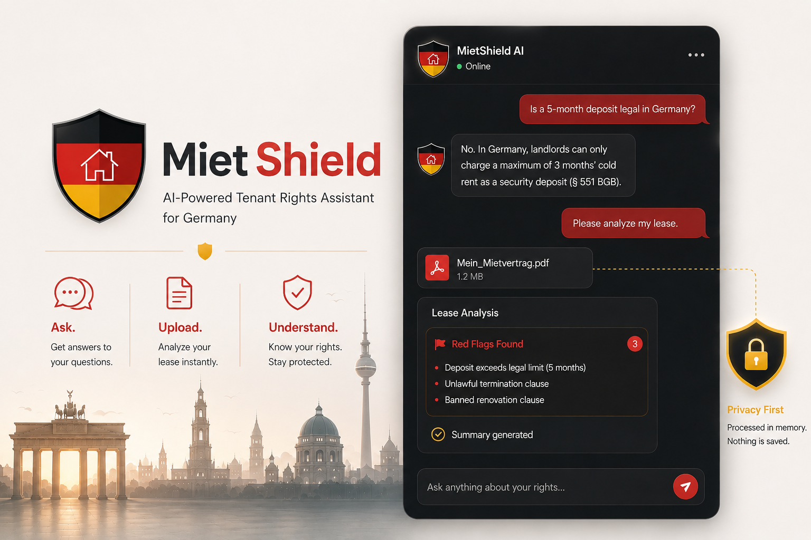

# MietShield 🛡️

> *Miet (rent) + Shield (protection)* — An AI-powered tenant rights assistant for Germany.

**[🚀 Try it live here!](https://miet-shield-s3xb4sa2t-ns-projects-c580f145.vercel.app/)**



**MietShield** helps tenants — especially international students and expats — understand their rights under German rental law (*Mietrecht*). It is powered by a multi-agent AI system built with **LangGraph** and served via **FastAPI**, with a zero-friction ChatGPT-style interface.

---

## ✨ Features

- 💬 **Conversational AI:** Ask questions about your rights, notice periods, and deposit rules.
- 📄 **Lease Analysis:** Attach a PDF lease directly in the chat. The AI will extract clauses, flag illegal terms (Red Flags 🔴), and summarize everything natively in the chat feed.
- 🧠 **Context-Aware Memory:** Built on LangGraph's `SqliteSaver`, the AI remembers the lease you uploaded and the context of the entire conversation for seamless follow-up questions.
- 🔒 **Privacy-First Processing:** Leases are processed entirely in memory (RAM). Files are never saved to disk or a database, ensuring maximum tenant privacy.
- ⚡ **Zero-Friction "Guest Mode":** Session management uses Local Storage, allowing users to interact with the app instantly without signing up.

## 🛠️ Tech Stack

- **Frontend:** Vanilla HTML, CSS (Glassmorphism UI), and JavaScript.
- **Backend:** Python, FastAPI.
- **AI Orchestration:** LangGraph, LangChain.
- **LLM Provider:** OpenRouter (Supports Llama 3.3 70B & Gemini 2.0 Flash).
- **Document Parsing:** PyMuPDF (`fitz`).
- **Deployment:** Optimized for Vercel Serverless (Python).

---

## 🚀 How to Run Locally

### 1. Prerequisites
Ensure you have Python 3.10+ installed.

### 2. Clone and Install
```bash
git clone https://github.com/ZiadXI/MietShield.git
cd MietShield

# Create and activate a virtual environment
python -m venv .venv
source .venv/bin/activate  # On Windows use: .\.venv\Scripts\activate

# Install dependencies
pip install -r requirements.txt
```

### 3. Environment Variables
Create a `.env` file in the root directory and add your OpenRouter API key:
```env
openai_api_key=sk-or-v1-YOUR_OPENROUTER_KEY_HERE
```

### 4. Start the Servers
You will need two terminal windows.

**Terminal 1 (Backend):**
```bash
uvicorn backend.main:app --reload
```

**Terminal 2 (Frontend):**
```bash
python -m http.server 5500 --directory frontend
```
Navigate to `http://127.0.0.1:5500` in your browser to start chatting!

---

## 🌐 Deployment (Vercel Serverless)

MietShield is architected to be deployed for free on Vercel, bypassing CORS issues by hosting both the frontend and backend on the same domain.

1. The project includes a `vercel.json` and `api/index.py`.
2. Push your code to GitHub.
3. Import the repository into Vercel.
4. Add your `openai_api_key` in the Vercel Environment Variables.
5. Vercel will automatically build the static frontend and route `/api/*` traffic to the Python Serverless functions.

> **Note:** Vercel's free tier has a 10-second timeout. Ensure you are using a fast model (like Gemini Flash) in `state.py` to prevent `504 Gateway Timeout` errors.

---
*Disclaimer: MietShield AI can make mistakes and hallucinate. It is not a substitute for official legal counsel (Mieterverein or Rechtsanwalt).*
